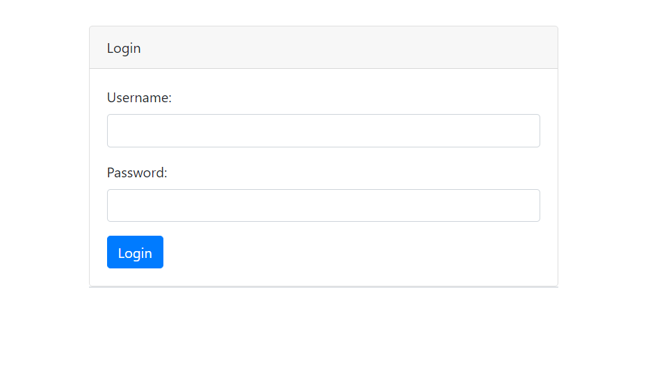
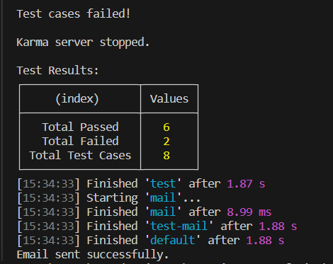
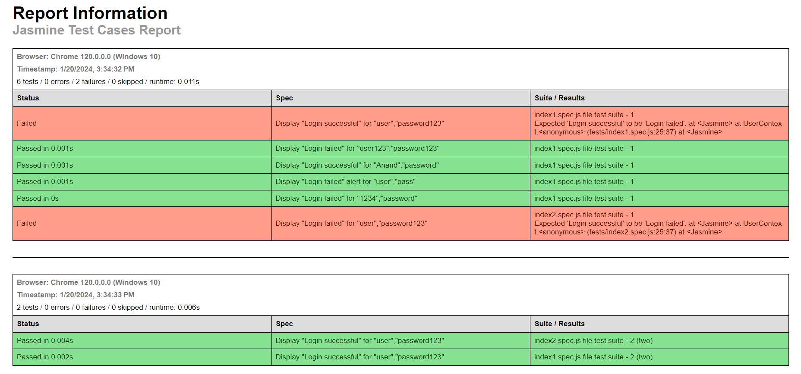

# Gulp Task for Simple Login Page with Jasmine Unit Testing 🚀

This project demonstrates a Gulp task for a simple login page created using Bootstrap. The task includes Jasmine unit testing with Karma and Gulp automation. The goal is to evaluate the login page's functionality, generate an HTML test report, and send an email notification with the test results.

## Project Overview 🚀

### Simple Login Page
- Designed a login page using Bootstrap with input fields for username and password.
- Included a login button to trigger the authentication process.

### Jasmine Unit Testing
- Developed Jasmine unit test cases to assess the login page's functionality.
- Ensured test coverage for scenarios such as login success and failure.

### Karma Test Execution
- Configured Karma to execute Jasmine test cases in the Chrome browser.
- Generated an HTML test report through Karma for detailed test results.

### Gulp Automation
- Implemented a Gulp task to set up and run the Karma server directly from the Gulp file.
- Integrated Gulp with an email plugin (Nodemailer) to send email notifications.

### Console Logging
- Log test case results in the console in a table format, providing details on total passed, total failed, and total test cases.

## Screenshots 📸

*Login Page*



*Test cases result in console*



*Generated report.html file*



## Prerequisites 📋

Before getting started, ensure that you have Node.js installed on your machine. You can download it from [Node.js official website](https://nodejs.org/).

## Getting Started 🛠️

1. **Install Dependencies:**
   - Navigate to the project root directory and run the below command to install project dependencies:
     ```bash
     npm install
     ```

2. **Configure Email:**
   - Open `helpers/nodemailerSetup.js` and update the email configuration (SMTP details). Provide your email ID and password.
   - Note: Email configuration is optional if you want to receive test results via email.

3. **Run Gulp Task:**
   - Execute the Gulp task using the command:
     ```bash
     npx gulp
     ```

4. **Check Console Output:**
   - View the console output for detailed information on test case results. A table will be generated in the console.

5. **Check Email (Optional):**
   - If email configuration is provided, check your email inbox for the test report.

6. **Generated Files:**
   - `report.html`: HTML test report generated in the root directory.

## Project Structure 🏗️

- **index.html**: Main HTML file containing the login page structure.
- **app.js**: JavaScript file with login page functionality.
- **style.css**: CSS file for styling the login page.
- **tests**: Folder with Jasmine unit test files.
- **gulpfile.js**: Gulp file defining tasks for Karma server and email sending.
- **helpers**: Folder with Nodemailer setup for sending emails.
```plaintext
root
│
├── node_modules
├── helpers
│   └── nodemailerSetup.js
├── src
│   ├── index.html
│   └── app.js
├── tests
│   ├── index1.spec.js
│   └── index2.spec.js
├── gulpfile.js
├── karma.conf.js
├── package.json
├── package-lock.json
└── report.html (generated after running gulp)
```

## Technologies Used 🛠️

- **Bootstrap**: Front-end framework for designing the login page.
- **Jasmine**: Testing framework for unit tests.
- **Karma**: Test runner for executing Jasmine tests.
- **Gulp**: Task runner for automation.
- **Nodemailer**: Node.js module for sending emails.

## License 📜

This project is licensed under the [MIT License](./LICENSE) - see the [LICENSE](./LICENSE) file for details.

